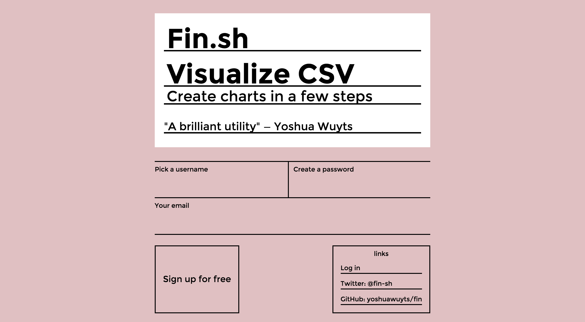

# fancy-form
[![build status][travis-image]][travis-url]
[![Test coverage][coveralls-image]][coveralls-url]
[![js-standard-style][standard-image]][standard-url]

A form that tries to do well on terms of both UX and code. On the one hand
it's modular, concise and snappy. On the other hand it feels pleasant,
helpful and is recognizable. Consider this an exercise in overengineering.



## Installation
```bash
$ hub clone yoshuawuyts/fancy-form
```

## Features
- ~~design~~
- use deku
- use webcomponents
- feedback on successful entry
- password strength progress counter
- helpful validation messages
- loading state on button while XHR request completes (possible with progress?)
- gridless CSS (or equivalent with flexbox)
- ARIA tags
- mobile compatible
- touch compatible (haptic feedback, anyone?)
- reduce nested html tags to an absolute minimum
- i18n thingy

## See Also
- [Bureaucracy by David Graeber book cover](https://www.pinterest.com/pin/152348399871058312/) - design inspiration

## License
[MIT](https://tldrlegal.com/license/mit-license)

[travis-image]: https://img.shields.io/travis/yoshuawuyts/fancy-form.svg?style=flat-square
[travis-url]: https://travis-ci.org/yoshuawuyts/fancy-form
[coveralls-image]: https://img.shields.io/coveralls/yoshuawuyts/fancy-form.svg?style=flat-square
[coveralls-url]: https://coveralls.io/r/yoshuawuyts/fancy-form?branch=master
[standard-image]: https://img.shields.io/badge/code%20style-standard-brightgreen.svg?style=flat-square
[standard-url]: https://github.com/feross/standard
